# 디렉터를 위한 AI 작업 개념 가이드

> 아스트랄 노바 프로젝트 기준 | 비개발자 디렉터용 레퍼런스

---

## 이 문서는 어떻게 쓰는가

"시킬 수 있는 게 뭔지 알아야 시킬 수 있다."

이 가이드는 매일 하는 작업 순서로 구성했다. 파일을 열고, 스킬을 부르고, 에이전트를 투입하고, 결과를 검증하는 흐름이다. 개념마다 아스트랄 노바 실제 사례를 붙였다. 정의보다 "이걸 모르면 이런 일이 생긴다"를 먼저 쓴다.

---

## 1단계 — 파일을 여는 순간 (파일·구조 기초)

### 마크다운(.md) — AI와 사람이 같이 읽는 문서 형식

마크다운은 메모장에 `#`과 `-`를 쳐서 구조를 만드는 방식이다. Word가 없어도 누구나 읽고 AI도 바로 처리한다.

**이걸 모르면:** AI한테 "세계관 문서 읽어" 라고 해도 `.hwp`나 `.docx`는 AI가 제대로 못 읽는다. 아스트랄 노바의 `세계관-결정록.md`가 마크다운인 이유가 여기 있다.

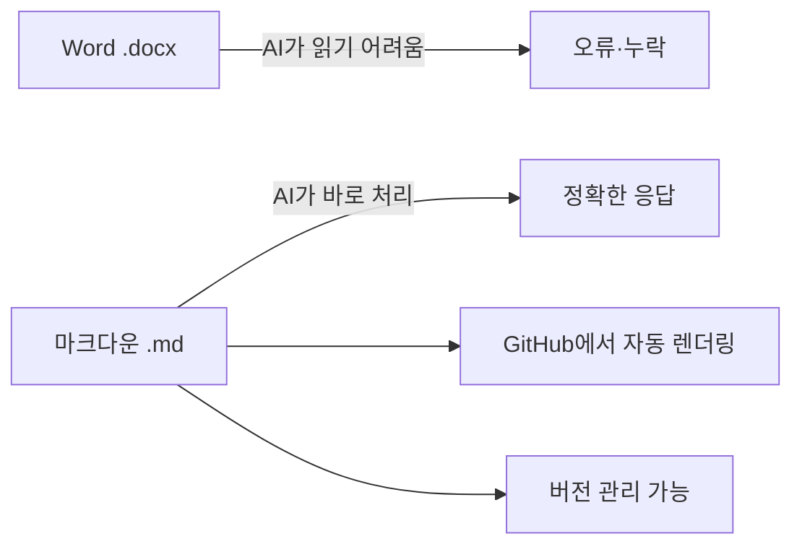

---

### YAML frontmatter — 파일의 이름표

파일 맨 위에 `---`로 감싼 구역이다. 사람이 안 읽어도 AI와 시스템이 먼저 본다. 책 표지의 ISBN 같은 것.

**이걸 모르면:** AI가 초안인지 확정인지 구분 못 해서 "아직 미정인 설정"을 "확정 설정"처럼 사용한다.

```yaml
---
status: confirmed        # confirmed / draft / pending
category: worldbuilding
last-updated: 2026-04-17
---
```

아스트랄 노바 사례: `세계관-결정록.md`의 83개 설정 각각에 `status: confirmed`가 붙으면, AI가 모순 감지를 할 때 초안 설정과 구분해서 판단한다.

---

### CLAUDE.md — AI한테 거는 사무실 벽 포스터

프로젝트 폴더에 딱 하나 두는 파일. Claude가 이 프로젝트를 시작할 때 자동으로 읽는 규칙서다. "이 프로젝트에서 이렇게 행동해라"를 한 번만 쓰면 매번 말 안 해도 된다.

**이걸 모르면:** 매 세션마다 "허밍 금지", "음성 오인식 보정", "에이전트 구조" 를 다시 설명해야 한다.

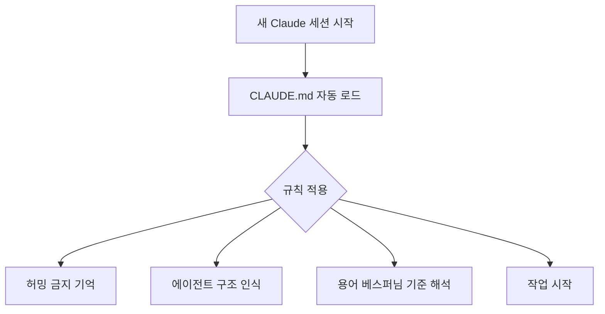

---

### 폴더 구조 — AI가 파일을 찾는 지도

AI는 파일 이름과 위치를 보고 맥락을 유추한다. 폴더 구조가 곧 AI의 지도다.

**이걸 모르면:** `스킬.md`를 아무 곳에나 두면 AI가 "이게 세계관 문서야, 설정 파일이야?" 를 혼동한다.

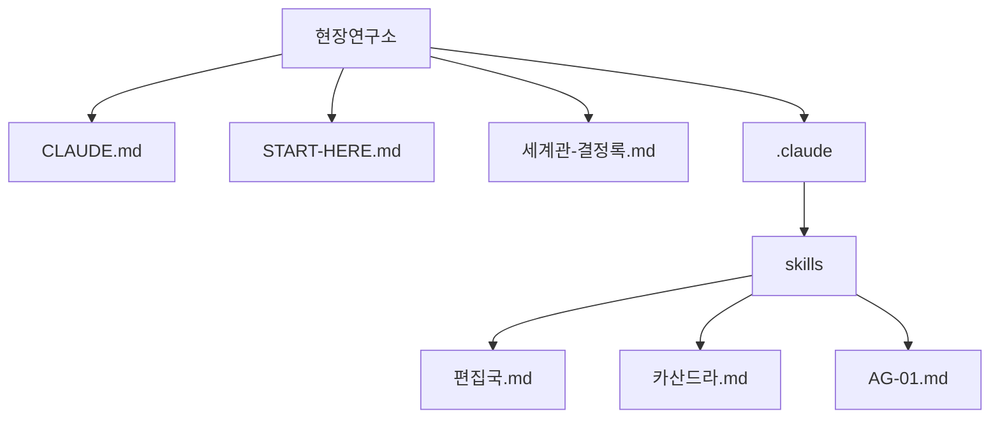

---

## 2단계 — 스킬을 부르는 순간 (AI를 부리는 구조)

### 스킬(Skill) — AI한테 역할을 입히는 것

`.claude/skills/` 폴더에 있는 `.md` 파일들. 이 파일을 불러오면 Claude가 그 역할을 입고 그 방식으로만 말한다. 배우한테 대본을 주는 것.

**이걸 모르면:** 매번 "너는 세계관 편집자야, 이런 방식으로 해줘" 를 타이핑해야 한다.

아스트랄 노바 사례: `/편집국`을 부르면 Claude가 세계관 일관성 검토자로 전환된다. `/카산드라`를 부르면 예언자 캐릭터의 문체로 글을 쓴다.

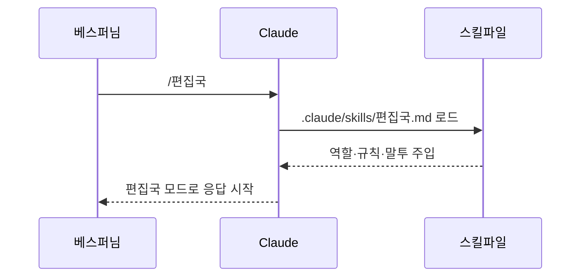

---

### 서브에이전트 — 부하 직원을 불러서 일 시키는 것

노아(메인 Claude)가 다른 Claude 인스턴스를 여러 개 불러서 각자 다른 일을 동시에 시키는 구조. A조가 4명이 동시에 조사하는 것이 바로 이것.

**이걸 모르면:** 조사 → 분석 → 검증을 혼자 하나씩 시켜야 해서 시간이 3~4배 걸린다.

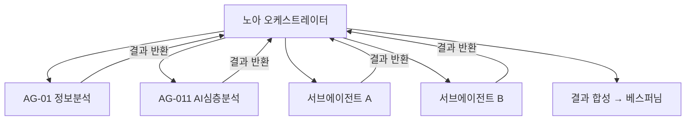

---

### 컨텍스트 윈도우 — AI의 책상 크기

AI가 한 번에 기억할 수 있는 내용의 한계. 책상이 좁으면 서류를 다 올려놓지 못한다. 세션이 길어지면 AI가 앞에서 한 말을 "잊는" 이유가 여기 있다.

**이걸 모르면:** 긴 세션 후반에 AI가 초반 설정과 모순된 말을 해도 왜 그런지 모른다.

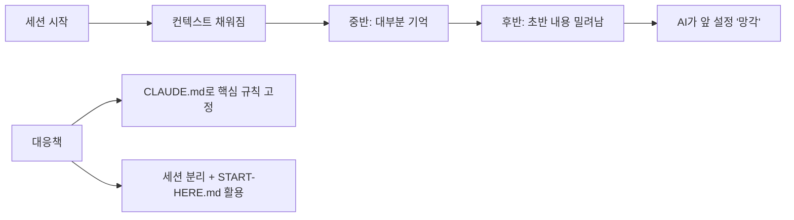

---

### MCP — AI가 외부 도구를 쓸 수 있게 연결하는 규격

MCP(Model Context Protocol)는 AI가 크롬, 데이터베이스, 파일 시스템, Slack 같은 외부 도구를 직접 다룰 수 있게 하는 표준 연결 방식. 에이전트에게 손과 발을 달아주는 것.

**이걸 모르면:** AI가 "브라우저 열어서 확인해봐" 같은 요청을 받아도 아무것도 못 한다.

아스트랄 노바 사례: MCP로 GitHub에 연결하면 AI가 직접 커밋하고 푸시한다. 그래프 DB(Neo4j)에 MCP로 연결하면 AI가 직접 관계 쿼리를 실행한다.

---

### 프롬프트 vs 온톨로지 — 명령 vs 지식 구조

| 구분 | 프롬프트 | 온톨로지 |
|------|----------|----------|
| 형태 | 그때그때 말로 지시 | 체계적으로 정리된 지식 구조 |
| 비유 | "오늘 이것 해줘" | "우리 회사 업무 매뉴얼" |
| 한계 | 매번 설명해야 함 | 구축 비용이 큼 |
| 아스트랄 노바 적용 | 스킬 호출 명령 | 세계관-결정록.md + 편집국 시스템 |

OpenCrab 같은 "온톨로지팩" 서비스는 이 지식 구조를 미리 만들어서 파는 것.

---

## 3단계 — 에이전트를 투입하는 순간 (세계관 관리 개념)

### 권위 계층 — 확정/초안/미정을 왜 구분하는가

모든 설정이 같은 권위를 가지면 AI가 "이게 맞는 설정이야?" 를 판단할 수 없다. 확정 설정이 기준점(닻)이 되어야 흔들리지 않는다.

**이걸 모르면:** AI가 초안 아이디어를 확정 설정처럼 써서 문서 전체가 혼선에 빠진다.

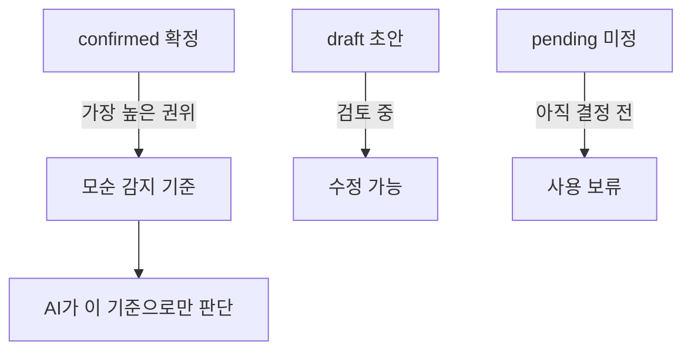

아스트랄 노바 사례: 83개 `confirmed` 설정은 어떤 에이전트가 와도 건드리지 않는다. `pending` 설정은 편집국이 "아직 확정 안 됐습니다" 라고 명시한다.

---

### 모순 감지 — AI가 설정 충돌을 찾는 방식

세계관 문서가 수십 개가 되면 사람이 모순을 다 잡을 수 없다. AI가 confirmed 설정들을 전부 읽고 서로 충돌하는 부분을 찾아내는 작업이다.

**이걸 모르면:** "아카샤는 과거 기억 저장소"인데 어떤 문서는 "아카샤는 미래 예언 기관"이라고 써도 아무도 못 잡는다.

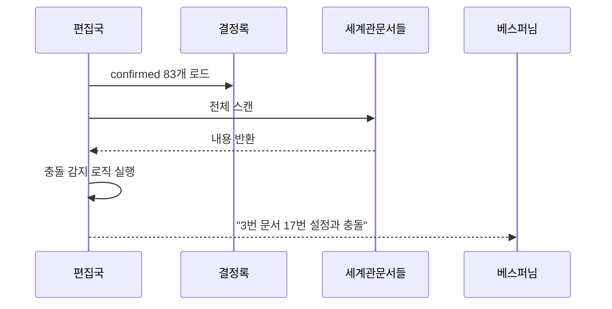

---

### 이중저장 — 작업용 노트와 창작용 백과

작업 중 떠오른 아이디어(노트)와 확정된 세계관 지식(백과)은 다른 곳에 저장해야 한다. 서랍과 전시장을 구분하는 것.

**이걸 모르면:** 작업 메모가 세계관 설정으로 굳어지거나, 확정 설정이 메모 더미에 묻힌다.

| 저장소 | 역할 | 예시 |
|--------|------|------|
| 세션기록/NOA-SES-N.md | 작업 중 메모 · 결정 과정 | "오늘 아카샤 방향 논의함" |
| 세계관-결정록.md | 확정 설정 백과 | "아카샤: 과거 문명 기억 저장소 [confirmed]" |
| GitHub Landing-Page | 조사 결과 축적 | 외부 서비스·도구 리서치 |

---

### lint — 자동 검증, 맞춤법 검사 같은 것

lint는 문서나 코드를 자동으로 훑어서 규칙 위반을 잡아주는 것. 세계관 문서라면 "frontmatter 빠진 파일", "status 없는 설정", "링크 깨진 항목"을 자동 감지한다.

**이걸 모르면:** 문서가 100개가 넘어가면 "이 파일 frontmatter 있나?" 를 사람이 일일이 확인해야 한다.

---

## 4단계 — 결과를 검증하는 순간 (기술 아키텍처 개념)

### Git/GitHub — 파일 변경 이력 관리 + 공유 저장소

Git = 변경 기록 추적기. GitHub = 그 기록을 인터넷에 올려두는 곳.

**이걸 모르면:** AI가 잘못 수정한 파일을 되돌릴 수 없다. 어제 버전이 어디 있는지 모른다.

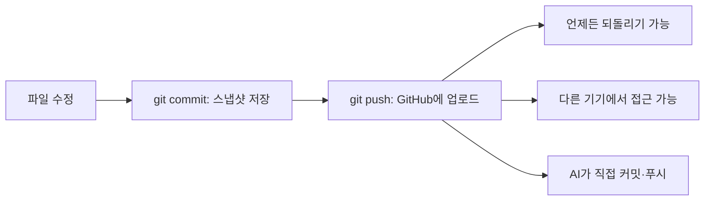

아스트랄 노바 사례: `Landing-Page` 레포가 지식창고. 조사 결과를 AI가 직접 커밋해서 세션 간 지식이 축적된다.

---

### API — 프로그램끼리 대화하는 방법

AI 서비스(Claude, GPT, Codex)를 직접 코드로 호출하는 방식. 채팅창을 열지 않고 프로그램이 AI한테 질문하고 답을 받는 것. 이 방식은 호출마다 비용이 발생한다.

**이걸 모르면:** "AI가 자동으로 처리해줬으면 좋겠다"고 할 때, 그게 API 없이는 불가능하다는 걸 모른다.

아스트랄 노바 사례: Claude와 Codex(OpenAI)를 교차 검증에 쓰는 것이 API 활용이다. 같은 질문을 두 AI한테 보내고 답을 비교하는 것.

---

### NER — AI가 글에서 이름·장소·사건을 자동으로 찾는 것

NER(Named Entity Recognition) = AI가 텍스트를 읽고 "이건 캐릭터 이름", "이건 지명", "이건 사건"을 자동으로 태깅하는 기술.

**이걸 모르면:** 세계관 문서 50개에서 "아니마"가 몇 번 나오고 어떤 맥락에서 쓰였는지 사람이 직접 찾아야 한다.

아스트랄 노바 사례: NER을 돌리면 "아니마 - 50회 언급 - 성역 33회 공동 등장" 같은 관계 지도가 자동으로 나온다.

---

### 그래프 DB — 관계를 그물처럼 저장하는 데이터베이스

일반 DB는 표(엑셀 같은 것)로 저장한다. 그래프 DB는 "누가 누구와 연결됐는가"를 노드와 엣지로 저장한다. 인물 관계도가 데이터베이스 안에 그대로 들어있는 것.

**이걸 모르면:** "아니마와 연관된 모든 장소와 사건을 찾아줘"를 마크다운 파일만으로 구현하려면 AI가 전체 문서를 매번 다 읽어야 한다.

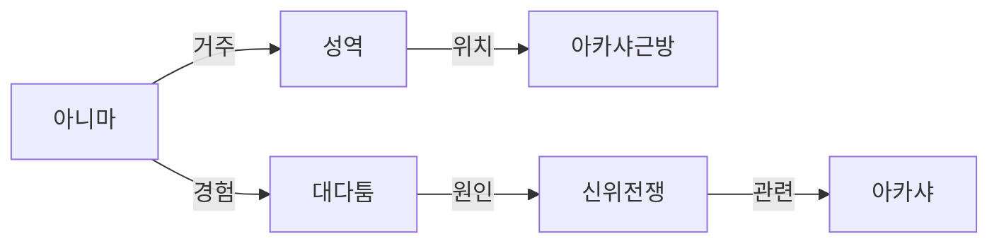

아스트랄 노바 맥락: Neo4j/Graphiti가 이 용도다. Graphiti는 AI 에이전트가 대화 중에 자동으로 관계를 추출해서 그래프로 쌓아준다.

---

### 온톨로지 — 전문 지식을 체계적으로 정리한 구조

단순한 단어 목록이 아니라 "A는 B의 상위 개념", "C는 D를 포함한다", "E는 F의 반대" 같은 관계까지 정의한 지식 체계.

**이걸 모르면:** AI한테 "성역"을 설명할 때 매번 "성역은 아니마의 안전지대야, 대다툼과 관련 있고..."를 처음부터 말해야 한다. 온톨로지가 있으면 AI가 이미 안다.

---

## 전체 작업 흐름 요약

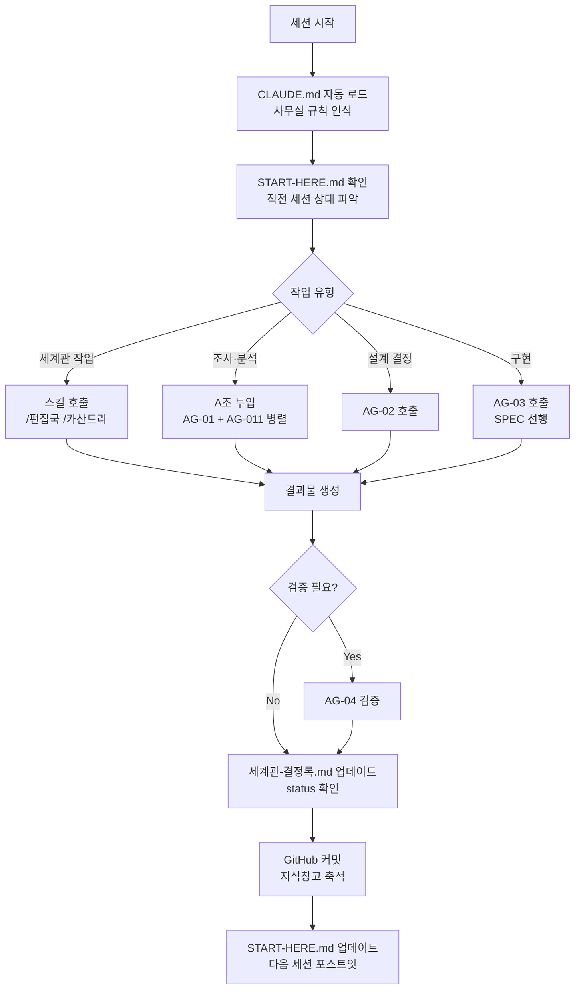

---

## 개념 빠른 참조표

| 개념 | 한 줄 비유 | 아스트랄 노바 사례 |
|------|-----------|-------------------|
| 마크다운(.md) | AI와 사람이 같이 읽는 노트 형식 | 세계관-결정록.md |
| YAML frontmatter | 파일의 이름표 | status: confirmed |
| CLAUDE.md | 사무실 벽 포스터 | 허밍 금지·에이전트 구조 정의 |
| 스킬(Skill) | AI한테 입히는 역할 대본 | /편집국, /카산드라 |
| 서브에이전트 | 동시에 부리는 부하 직원 | A조 4명 병렬 투입 |
| 컨텍스트 윈도우 | AI의 책상 크기 | 세션 후반 망각 현상 |
| MCP | AI에 손발 달아주기 | GitHub 직접 커밋 |
| 권위 계층 | 확정/초안/미정 구분 | 83개 confirmed 설정 |
| 모순 감지 | 설정 충돌 자동 탐지 | 편집국 시스템 |
| Git/GitHub | 파일 타임머신 + 공유 저장소 | Landing-Page 지식창고 |
| API | 프로그램이 AI한테 직접 말 거는 방법 | Claude·Codex 교차 검증 |
| NER | AI가 이름·장소를 자동 태깅 | 세계관 문서 관계 추출 |
| 그래프 DB | 관계를 그물로 저장하는 DB | Neo4j/Graphiti |
| 온톨로지 | AI가 미리 아는 지식 체계 | OpenCrab 온톨로지팩 |
| lint | 규칙 위반 자동 검사기 | frontmatter 누락 감지 |

---

> 마지막 업데이트: 2026-05-08 | AG-02 설계 지원 에이전트 작성
